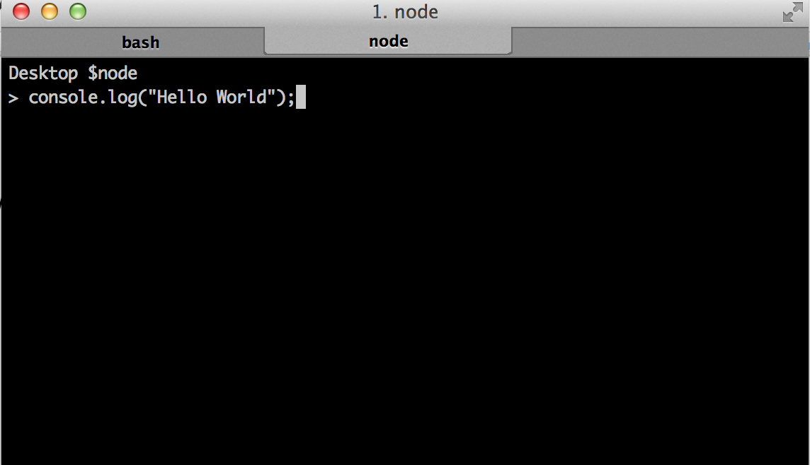

# Running JavaScript Code

## JavaScript Environment

JavaScript is the language of the internet! Whenever you browse your favorite website
(google, facebook, twitter, appacademy.io), your web browser is running JavaScript.
JavaScript runs in 2 main environments: the browser (chrome, firefox, etc.) and Node.
Using the browser involves more than just understanding JavaScript, but also HTML, CSS,
and familiarity with the browser environment. Running our code in the Node environment will
allow us to focus purely on learning JavaScript.

So what is Node exactly? The [website](https://nodejs.org/en/) has a pretty good
description. But the gist is that it is a way of running JavaScript outside of the
 browser environment.

Go to the website and download Node if you haven't already. After you've downloaded
 it, open your Terminal/Command Prompt and type:



Macs: Terminal is an application on your computer so you'd access it the
same way you would other applications (e.g. Chrome, App Store, Calendar, etc.). You
 can find it either via the Applications folder using Finder or via Spotlight Search
 (the magnifying glass in the upper-left corner of your screen) and searching for
 Terminal.

PCs: Similarly, Command Prompt is an application which you can access and use.

Remember that there are two ways that we will run JavaScript code in this course:
using the **Node REPL** and using node to run a **js file**. This document outlines
how to properly run JavaScript.

## Node REPL vs JS File
Both the Node REPL and using a file are common ways to run JavaScript code, but
they are useful in different scenarios:

**Node REPL** (read, evaluate, print, loop) is used for testing quick ideas and
one-liners. It is very useful when playing around with any curiosities you have
because you can see how expressions are evaluated as you type them. Any code that
 you type into the Node REPL will be lost when you exit it. We will use the Node
 REPL during lecture to play around one-liners because it gives us immediate feedback.

**JS Files** are used for saving code for the long term. If you save code to a
`.js` file, you can always read it later, make edits, etc.. When we work on problem
 sets, assessments, and anything else you want to save, we should save our code to
 a file!

## Using the Node REPL
To use the **Node REPL**, simply open up your command line (Terminal on Mac, Command
  Prompt on Windows) and enter the command `node`. In the examples below we use
  `$` to show that we are in the command line.

```
$ node
>
```

Notice that as soon as we enter the `node` command, we get a little `>` on our screen.
This `>` means that we are inside the Node REPL, so we can type any valid JavaScript
 lines and see what they evaluate to:

```
$ node
> 1 + 1
2
> var message = "Hello" + "world"
undefined
> message
'Helloworld'
>
```

One thing to notice is that when we enter our JS line, the REPL will print out what
 it evaluates to. After it prints, it will wait for more JavaScript to be entered because we see `>`.

Let's say we are done with the **Node REPL**, and want to go back to our plain
old command line. To exit, enter the line `.exit` in the REPL. Doing this will
get rid of the `>`, which means we are no longer in the REPL. When we are back
inside our command line we can enter those commands like `cd`, `ls`, `dir`, etc..

```
$ node
> 1 + 1
2
> "How do I get out of here" + "!?!?"
'How do I get out of here!?!?'
> .exit
$
```

## Using JavaScript Files
First create a `.js` file in Atom and make sure you have it saved somewhere accessible, like you `Desktop` folder.
To run a JavaScript file, make sure that you have a file saved that ends in `.js`, for example `myFile.js`.

To run a JS file you need to first go into the folder that contains it using `cd`
 in your command line. Feel free to use `ls` to list your folders and see where
 you have to go. Once you are inside of the correct folder, run `node <fileName>`,
  for example `node myFile.js`. When you run enter these commands, be aware of the
   capitalization. File names are case sensitive!

```
$ ls
Downloads
Desktop
Music
Videos

$ cd Desktop
$ ls
myFile.js
aTextDocument.doc
someMusic.mp3
$ node myFile.js
Hello world
$
```

Like you guessed, the `myFile.js` file from the example above simply has one line in
it `console.log("Hello World");`.

## Practice
Practice playing around with the Node REPL and JS files. At first it may be hard
 to navigate the command line, but as programmers we will spend a lot of time using
 this tool. Practice, practice, practice!
