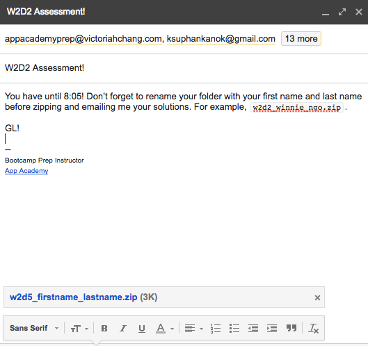

# Bootcamp Prep Assessments

Students are given two assessments a week, one on Monday and one on Friday (except the first Monday).

On Fridays, you will solve Friday's review problems in front of the students during the first hour. Then you will have students take the assessment for the remaining hour. Students must email you their assessments before leaving. Those who finish early can leave early as long as they have emailed you their assessments. Read more about Friday assessments [here](./friday_assessment.md).

Over the weekend, students are expected to watch the solution videos and study over the weekend. They **must** submit a perfect assessment to you before class on Monday. Failure to do so, earns them a strike.

On Mondays, you will have students take the assessment for the first hour. Students must email you their assessment by 7:05 PM. Then you will solve Monday's test in front of the students for the remaining hour. Read more about Monday assessments [here](./monday_assessment.md).

## Problem Solving
Whenever you are solving problems in front of the students, it is very important that you vocalize your thought process and how you are going about solving the problem. Students will learn so much from seeing how you approach these problems.
  * It is important to speak slowly and clearly explain why you are making the decisions you are making.
  * Read the problem aloud and look at the examples.
  * Explain your logic and approach.
  * Walk through how you translate your solution into code.
  * Encourage students to ask any questions they might have as you solve a problem.
  * Don't be afraid to make mistakes as long as you correct them. Students probably made the same mistake and perhaps got stuck on that bug. Make sure you talk them through your debugging process whenever you do make a mistake.

## Each Assessment
#### Before:
  * Download the assessment from the Bootcamp-Prep-Assessments [repo](https://github.com/appacademy/Bootcamp-Prep-Assessments).
    * I've found that it's easiest to clone the repo onto your computer and then to select the folder from your local directory. Make sure to always pull for changes if you do this.
  * Make sure you do not download and share a folder with the solutions in it.
  * Change the folder's name to `{date}_firstname_lastname`, substituting `date`.
    * For example, w2d5's assessment's folder should be renamed `w2d5_firstname_lastname`.
  * Compress the folder into a .zip file.
  * Email students the compressed file as an attachment. For example,
    
  * Make sure students don't download their attachments into the Downloads folder. Have them move them to a different directory (e.g. the Desktop folder) before they start working on their solutions.
  * Make sure students are able to run mocha at least once before starting.

#### During:
  * Be available to answer any questions.
    * I usually answer questions about the prompt, the underlying logic, and deciphering mocha in depth.
    * I usually skip those about syntax and methods because those are things I want students to memorize.
    * I try to guide students when they're stuck debugging vs. telling them what/where their bug is. If they can't figure it out, then I tell them to move on to the next problem.
  * Students who finish early:
    * On Mondays, they can leave after emailing you their solutions.
    * On Fridays, I have them work on problems until the hour's up. If they've finished all of the problems from that week's problem sets, I direct them to the review problems. If they finished that earlier on their own, I direct them to the [bonus problems](https://github.com/appacademy/Bootcamp-Prep-Curriculum/tree/master/bonus_problems).

#### After:
  * When students are finish:
    * Please first have them rename their solutions folder with their first name and last name. For example, my  `w2d5_firstname_lastname` folder should be renamed `w2d5_winnie_ngo`.
    * Then have them compress the renamed folder. If they only change the .zip file's name, then when you uncompress their .zip file you won't be able to tell whose folder it is.
    * Lastly, have each student reply to your email and attach his/her .zip file.
  * Fridays:
    * Upload links to the solution videos after class. See [this](./friday_assessment.md#uploading-solution-videos) for more details.
    * Remind students that they must send you a perfect assessment before class on Monday or else they will earn a strike.
  * Mondays:
    * Solve the assessment in front of the students.
