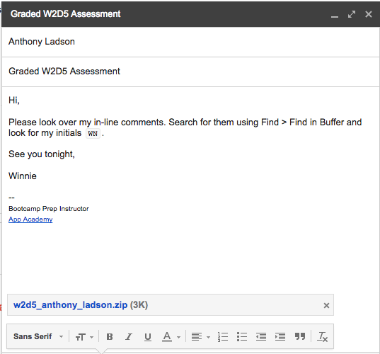

## Monday Assessments

Students will have a total of three Monday assessments. They will not have one the first Monday, but they will have one week 2, 3 and 4. These assessments will be scored and given feedback on.

### Monday's Schedule

* `6:00`
  - Email students the assessment.
* `6:00 to 7:00`
  - Students take the assessment and email you their solutions whenever they finish.
* `7:00 to 7:05`
  - Students who haven't finished, must email you their solutions by `7:05`.
* `7:05 to 8:00`
  - Solve the assessment in front of the students. Answer any questions they might have.

### Scoring
You will have to score Monday assessments.

A student's score is equal to how many specs his/her assessment passes. Add student scores to the `Student Info` spreadsheet.

Please reach out to students who passed 0 specs and/or scored below average on a Monday assessment. Come up with ways to help them catch up.

### Giving Feedback
You will have to give feedback on Monday assessments. Please email each student students with a copy of his/her solutions with your comments before Friday.

Using in-line comments and comment blocks, you should give students feedback on:
* Correct solutions (e.g. "Good job!")
* Poor style (e.g. incorrect indexing, inconsistent spacing, poor variable names)
* Incorrect syntax (e.g. missing curly brackets, missing semi-colons)
* Wrong data type (e.g. calling a built-in method on the wrong data type)
* Poor logic (e.g. using a number instead of an array to accumulate values)
* Etc.

I follow each of my comments with my initials, which I tell students to search for when looking for my comments. When I'm done reviewing a student's solutions, I compress the folder and email him/her back with the resulting .zip file attached. For example, 

