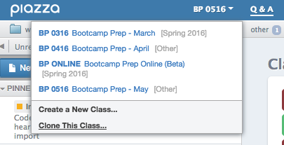
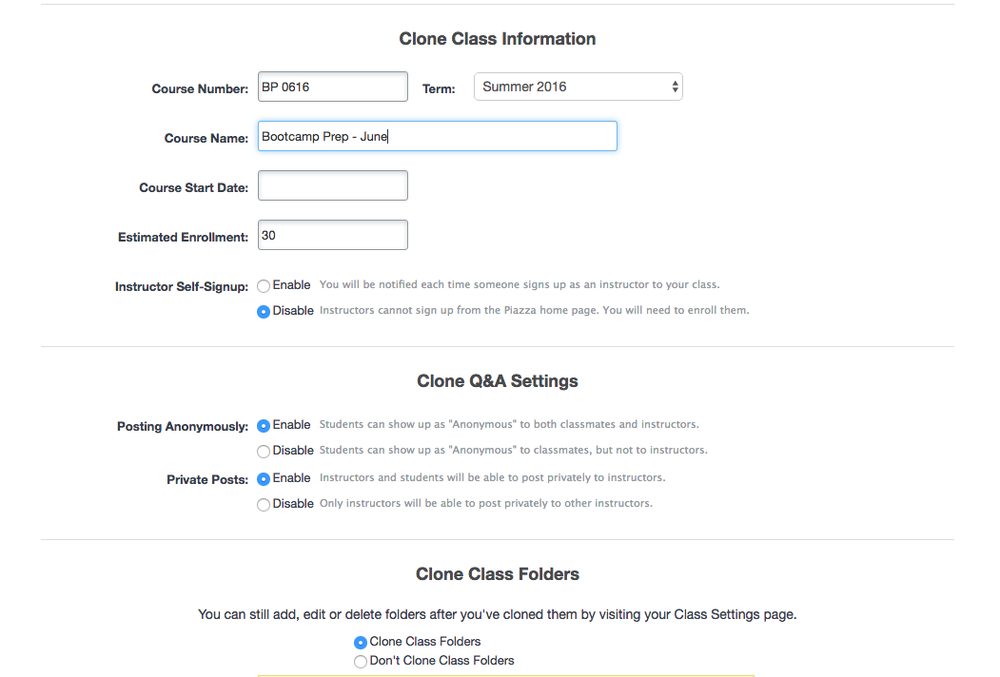
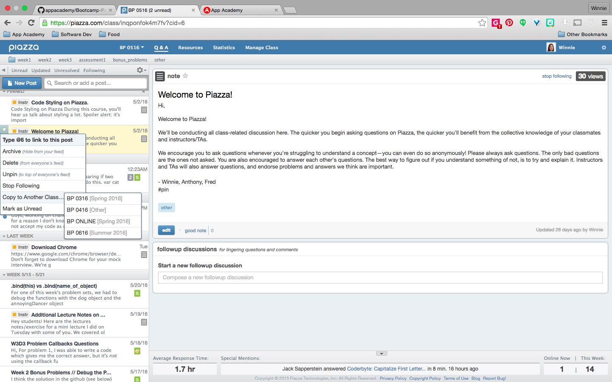
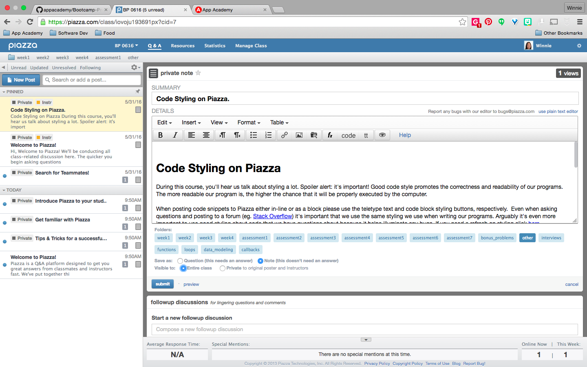
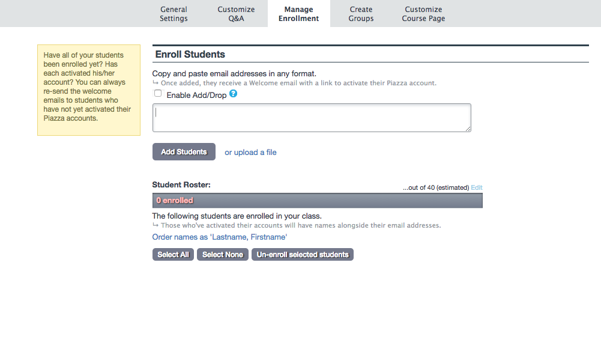

# Piazza

[Piazza](https://piazza.com/) is a great tool that we use offer students assistance outside of class time. Part of your role as an instructor will be to maintain your class' Piazza. Encourage Piazza usage! Cohorts with thriving Piazza classes usually perform better than cohorts without.

+ Before the start of each cohort:
  + [Create a New Class][new-class]
  + [Add Students][add-students]
+ During each cohort:
  + [Student Usage][students]
  + [Instructor Usage][instructors]
+ After each cohort:
  + [Post-Course][post-course]

[new-class]:#creating-a-new-class-on-piazza
[add-students]:#adding-students-to-piazza
[students]:#students-using-piazza
[instructors]:#instructors-using-piazza
[post-course]:#post-course

## Creating a New Class on Piazza

**YOU ARE NOT RESPONSIBLE FOR CREATING A NEW CLASS.**

Before the start of each cohort, a new Piazza class needs to be set up for the upcoming cohort.

2. Clone a pre-existing Bootcamp Prep class from the header's drop-down menu.

  

3. Rename the new class and edit the class information.

  

  + Edit the **Course Number** to `BP_{month}{year}`.
  + Update the **Term**.
  + Rename the **Coure Name** to `Bootcamp Prep - {month_name}`.
  + Select the **Course Start Date**.
  + Update **Estimated Enrollment**.
  + Disable **Instructor Self-Signup**.
  + Enable **Posting Anonymously**.
  + Enable **Private Posts**.
  + Select **Clone Class Folders**.

4. Save class.
5. Copy all pinned posts from a pre-existing Bootcamp Prep class to newly added class.

  

6. Select newly added class from header's drop-down menu.
7. Made all pinned posts public.

  
8. You're all set!

## Adding Students to Piazza

Add the emails of all students in the upcoming cohort before the start of each cohort. Make sure students have access by the end of the first day of class.

## Students using Piazza

From day one, encourage students to ask any questions they might have on Piazza and to answer their peer's questions. Remind them that they're only in class for two hours a day for four weeks. Class time is very limited and we cover a lot of material in that time. Undoubtedly, they will have questions. By being afraid or too lazy to ask these questions, they are not taking full advantage of the course and hurting their growth as a programmer. If they are afraid, remind them that questions can be asked and answered anonymously. If they are afraid to answer questions, remind them that the best way to test how well you understand something is to be able to teach it to another person. Answering questions on Piazza is a great way to test their knowledge, learn how to communicate code and good practice for technical interviews.

The only rule about using Piazza is that they must style any code that they write correctly. They can refer to the pinned post about **Code Styling on Piazza** if they have questions. Basically any JS code they write in their posts must either be in teletype text or a code block. They must also *always* follow JS styling conventions (indentation, etc.).

If students email you any of their questions, redirect them to them to Piazza. Share the question anonymously and answer their question there. Odds are, it's a question that another student has and it encourages students to use Piazza.

## Instructors using Piazza

Piazza is an online extension of the classroom. You'll be using it to answer student questions. I've also used it to share related and helpful information, and offer additional readings or problems to topics I've tabled in lecture. Please check and maintain it daily.

### Maintenance:
+ Answer any unanswered questions or unresolved followups.
+ Resolve followups.
+ Mark notes, student's answers, etc. as a `good note` when appropriate.
+ Add a post correcting any misconceptions, bad code and/or poor styling that you come across.

## Post-Course

Students will continue to have access to their Piazza class (as well as the Github repo) until the end of time! Encourage them to continue asking and answering questions there even though their cohort has ended. It's a great place for them to share any helpful resources (readings, problems etc.) that they find, organize study sessions, and support each other in their post-course study and bootcamp application process.

As an instructor, you will no longer have to maintain Piazza unless you want to.
