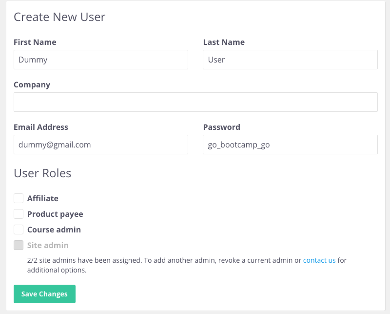
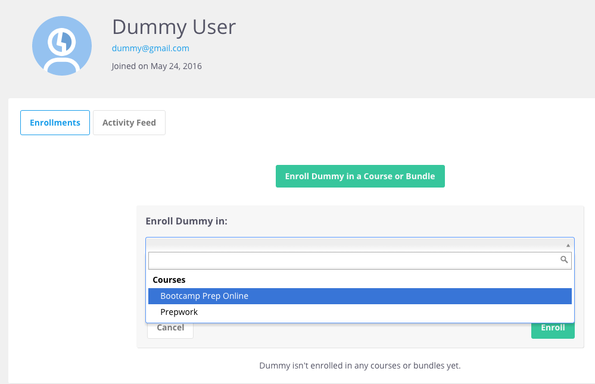

# Adding a New Tester

Periodically check this spreadsheet: https://docs.google.com/a/appacademy.io/spreadsheets/d/1CmszGD0EkD6sub-PNa97SyR9wt7LJOPT4akNcA2hwwY/edit?usp=sharing

Admin updates it whenever they receive agreement forms.

### If there's a new user:
1. Add them to Thinkific
  1. https://app-academy.thinkific.com/manage/users
  2. Click **Create New User**.
  3. Enter in their `First Name`, `Last Name` and `Email Address` from the spreadsheet.
  4. Enter in `go_bootcamp_go` for their `Password`.
  3. Click **Save Changes**.
  
  4. On the next page, click **Enroll in a Course or Bundle**.
  5. Select `Bootcamp Prep Online` under `Enroll in:`.
  6. Click **Enroll**.
  
  7. You'll receive an email notifying you that a learner has signed up at your school. However, the learner will not receive any email.
2. Email new tester with their credentials.

  ```
  To: {{Email Address}}
  Subject: Bootcamp Prep Online Access!
  ---

  Hey {{First Name}},

  You can access your account at:
  http://app-academy.thinkific.com/courses/bootcamp-prep-online

  Below are your credentials for signing in to Bootcamp Prep Online:

    Email: {{Email Address}}
    Password: go_bootcamp_go

  Sign in is located in the upper right-hand corner. Please change your password after logging in. Feel free to email me if you have any problems accessing your account or the course.

  The first few chapters have been released and we will continue releasing chapters as we complete them. Whenever you complete a chapter we’d like your feedback on the chapter. Feedback should be provided through a survey found at the end of each chapter (labeled “Feedback”). This is the most important thing for us because it’s what we will use to improve Bootcamp Prep Online for everyone using it.

  Thanks again for being a part of the development of Bootcamp Prep Online. Let’s get coding!

  Best,

  App Academy
  ```

  Replace `Email Address`, and `First Name`.
3. Add them to Piazza.
  1. Select `BP Online`.
  2. Click **Manage Class**.
  3. `Enroll Student` using their email address.
  4. Click **Add Students**

4. Update spreadsheet with `Access`, `Access Date` and `Piazza`.
