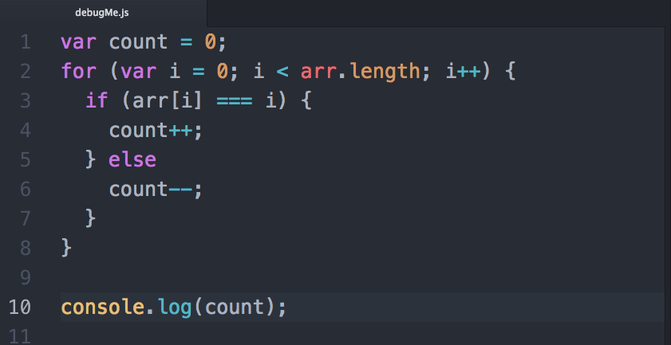
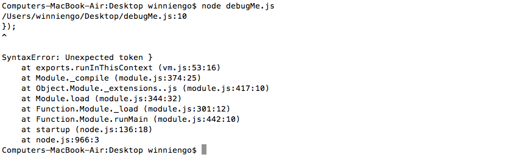
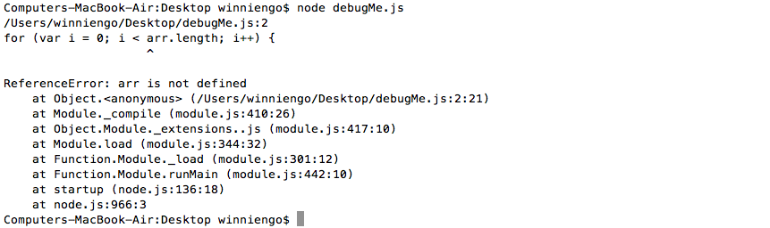
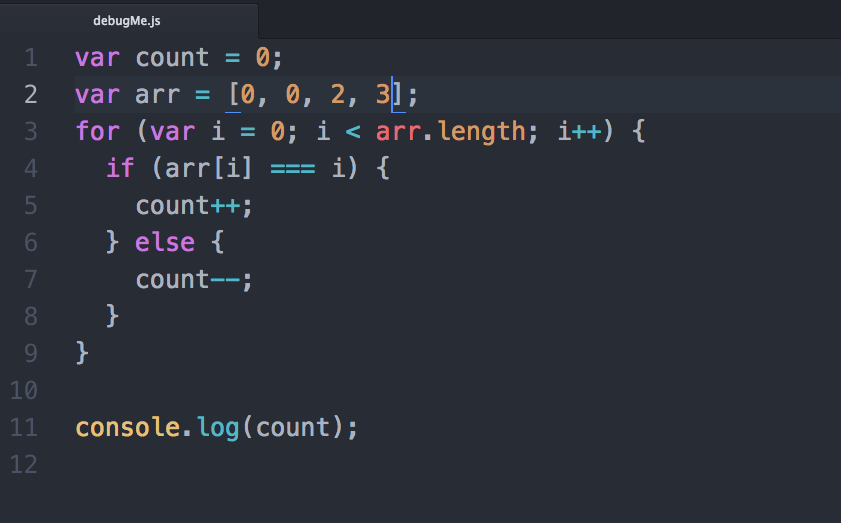
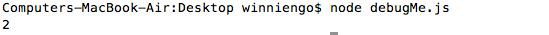

## Debugging
Errors in code are called *bugs*. Searching for and fixing errors your programs is called *debugging*.

Bugs will occur in your code all the time, whether you're a novice programmer or a senior software developer. That said, each bug you encounter will make finding a future bug easier. As you continue learning coding concepts and syntax, it's important to also learn  what doesn't work. Why did a bug occur? How do you fix it?

1. Read the error message:
  1. The filename
  1. The line number
  1. Type of error
2. Look at the stack trace
  1. Start from the top
  1. Keep going to a deeper level until you see you filename that looks familiar

~SCREENCAST START~
For example, let's debug this file together.


Do you understand what this program is trying to do? Maybe you already spot the bugs! Let's see what happens when we try to run this file:


Look's like there was an error. Let's walk through this error message together starting at the top. The first line indicates the file and line number at which the interpreter encountered an error. The second line is actually what code actually exist at that point. Below that, is the type of error (in this case, it's a Syntax Error) and a description: Unexpected token }. It's followed by the stack trace.

If appears that line 10 is just the last line of our file. However, if we look at my file, it appears that I'm missing a curly bracket at line 5.

```js
} else {
  count--;
}
```

If your file is missing a bracket or parenthesis, it's normal for the error messages to point to the last line of your file. With practice, you'll learn to check the rest of your program to fix this bug.



This time it's a Reference Error. `arr` is `undefined`. When variables are unexpectedly `undefined`, it usually means that you never declared it. Let's change that here by declaring `arr`.



Let's run it.



Bug free! As you write more and more complex programs, you'll encounter more complex bugs.
~SCREENCAST END~

~SCREENCAST START~
### Common Mistakes
* Mixing up assignment operator `=` and  the comparison operator `===`
* Accidental `undefined`'s or `NaN`'s
* Malformed `if`/`else if`/`else` blocks
* Malformed loops
* Hardcoding
* Variables out of scope

If you can't figure it out, refactor your code. If it's styled incorrectly, style it! Make it more readable. Decompose your methods.
~SCREENCAST END~
