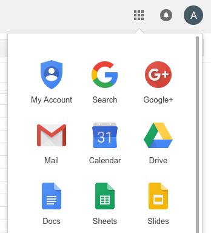
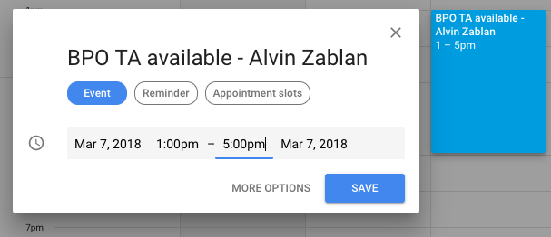
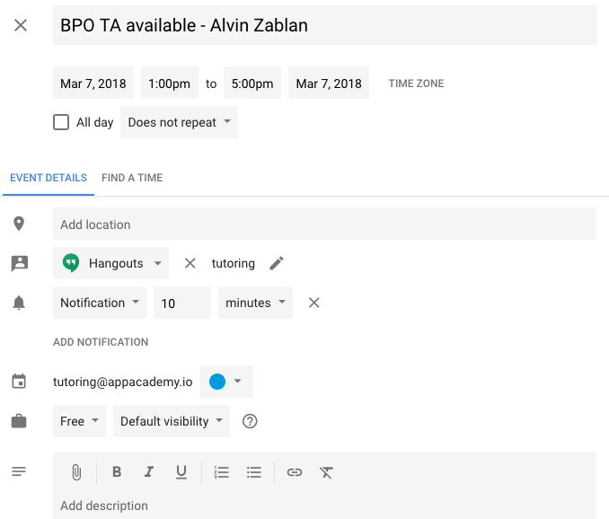

## Scheduling TA Shifts

As a BPO TA, you have flexibility when it comes to scheduling your shifts. This is
great as it will allow you to plan accordingly with your job search. You should schedule you
shifts in advance. **Every Thursday, your shifts for the following Monday through
Sunday are due to be finalized.**

Here are some guidelines to follow:
+ A shift must be 5 hours long
+ A shift consists of 4 hours of tutoring availability and 1 hour of dedicated grading
+ A shift must start and end between 9:00am - 11:00pm
+ A shift can be scheduled any day, including weekends
+ You should do 4 shifts a week
+ You should only have 1 shift scheduled for a single day

### Shift Breakdown

A shift is 5 hours long. However, 4 of those 5 hours will be your tutoring shift. The other 1 hour will
be dedicated to grading/commenting assessments. When setting your tutoring availability on the tutoring calendar,
be sure to not include the hour you will be grading assessments. Otherwise, you may not have any time to grade
assessments! That is, put down 4 tutoring hours per shift on the calendar, but you'll be working 1 additional
hour to just grade assessments.

### Before Scheduling a Shift

Before you set your shifts for the week. You should communicate your preferences
to your manager and the other TA's on the team. **The goal is to have a TA be available
to online students at some point in a day for all seven days in the week.** This
will allow us to provide a quick turnover for assessment feedback and broad availability
for tutoring. Giving personalized attention in this way is especially important for
an online course like BPO.

Although you have this flexibility when scheduling, you should use it responsibly.
When you schedule a shift on the calendar, students will be able to schedule their
tutoring sessions during your shift window. We should never change shifts last minute,
as this may mean we have to cancel any tutoring appointments booked. Since you chose
the times for your shifts, you'll be expected to stick to it.

### How to Schedule Your Tutoring Shifts

Every Thursday, your tutoring shifts for the following Monday through Sunday are due.
To set your shifts for a week, you'll need to access the following gmail account `tutoring@appacademy.io`. Ask your manager for the password. Be sure to follow the
below instructors for every shift!

+ Once logged into `tutoring@appacademy.io`, click on the G Suite menu, and go to `Calendar`:

+ On the calendar, click on your desired slot to create an event. You must title your
event `BPO TA available - Name`. You can edit the exact time for the event in
the event settings later. After naming the event, click `Edit event`. For example, here is a shift being created for John Doe:

+ After clicking `Edit event` you'll be able to edit more options for the event. Here
you'll need to do three things.
  + Set the exact times for your tutoring shift (it should be 4 hours long)
  + Set your shift to `Free` and not `Busy` (this is very important)
  + Save the event when you are done!

+ After you set your shifts for the coming week, give your manager a heads up for
review.
